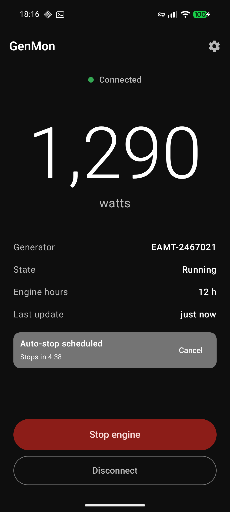
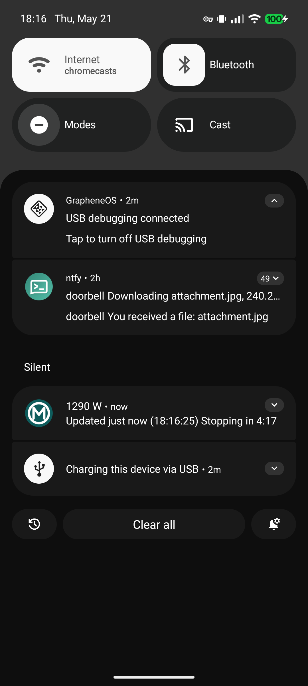
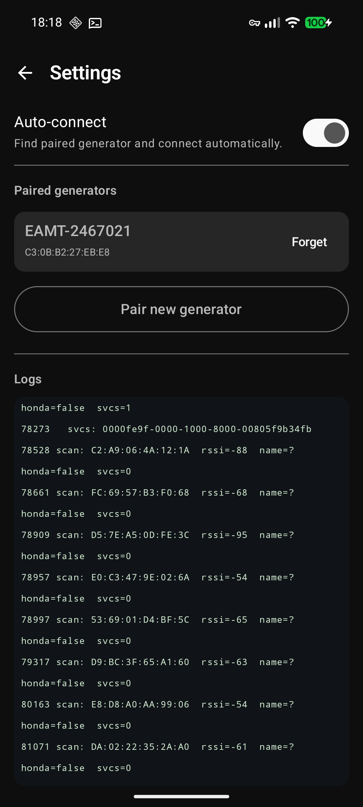

# hgenmon

An open-source Android app for monitoring Bluetooth-equipped inverter generators (EU2200i, EU3000iS, EU7000iS, and similar) over BLE. Independent project — not affiliated with, endorsed by, or supported by any generator manufacturer.

---

## ⚠️ Safety Notice

**Do not rely on this app for any safety-critical function.**

Inverter generators are hazardous equipment. They produce **carbon monoxide** in lethal quantities, run on flammable fuel, and output **electrical voltages that can injure or kill**. The generator's own hardware mechanisms — CO sensor, low-oil shutdown, overload cutoff, ground-fault interruption — are the only safety-rated systems on the unit. This app is a read-out / convenience tool that talks to the generator's Bluetooth module over a wireless link that can drop, lag, or report stale values at any time.

- **Never** treat the absence of an alert in this app as confirmation that no fault exists.
- **Never** operate a generator indoors, in a garage, or near open windows regardless of what any app says.
- The app provides **no remote-start** capability and never will — by design, the BLE protocol does not expose engine-start, only engine-stop.
- This software is provided **AS IS, WITHOUT WARRANTY OF ANY KIND**; see [LICENSE](LICENSE).

If you are not comfortable accepting all liability for how you use this software with your generator, do not use it.

---

## Install

[](https://apps.obtainium.imranr.dev/redirect?r=obtainium://add/https%3A%2F%2Fgithub.com%2Fddagunts%2Fhgenmon)

Or grab the latest signed APK directly from the [Releases page](https://github.com/ddagunts/hgenmon/releases/latest) and sideload it.

---

## Status

Tested against the EU2200i family (BT module codename "Z44A", confirmed against unit `EAMT-2467021`). Protocol notes in [`docs/protocol.md`](docs/protocol.md). What works today:

- BLE service/characteristic UUIDs and the ASCII diagnostic frame format
- Unlock handshake (default password)
- Serial-number read
- Telemetry polling — output power (watts, verified at 1290 W ground truth), engine hours
- Engine-stop command (7 retries per attempt)
- Persistent foreground-style notification with live readings + last-refresh time
- Alarm pipeline — WARNING/FAULT poll + EWI indication subscription → high-priority notification
- Connectivity-loss detection → high-priority notification
- Timed engine-stop (1, 5, 10, 15, 20, 25, 30, 45, 60, 90, 120, 180 min) with quiet/alarm result notifications
- Per-session blacklist for read frames the BT module firmware rejects (some Z44A firmwares respond to a subset of `OUTPUT_POWER`/`ENGINE_HOURS`/`WARNING`/`FAULT` group/dataNo combos)

Open: WRITE_1 (eco toggle) byte format; WARNING/FAULT bitfield → human-readable label decoding (currently surfaces raw hex); multi-profile support (currently Z44A only).

## Screens

<table>
<tr>
<td width="33%"></td>
<td width="33%"></td>
<td width="33%"></td>
</tr>
<tr>
<td><b>Main</b> — power reading, engine hours, last-update timer, auto-stop countdown banner, Stop engine / Stop in… / Disconnect.</td>
<td><b>Notification</b> — live power, "Updated X ago (HH:MM:SS)", and the active auto-stop countdown. Refreshes every second.</td>
<td><b>Settings</b> — auto-connect toggle, paired generators (tap to rename, "Forget" to delete), and the in-app log panel mirrored to Android Log.</td>
</tr>
</table>

## First-time connection

1. **Install + launch the app.** On first run you'll be prompted to grant Bluetooth scan/connect and (on Android 13+) notification permissions. Tap **Grant Bluetooth + notification permissions** and accept each prompt.
2. **Start the generator.** The BT module only advertises while the generator is running — leave it on choke if cold, but the engine must be turning.
3. **Pair (one time per generator).** Tap **Pair a generator**. The app scans for compatible BT modules (matched by service UUID); tap yours when it appears in the list. The app connects, reads the serial number, and lets you give it a friendly name. Once saved, the generator is remembered for next time.
4. **Connect.** Back on the main screen, tap **Connect**. With auto-connect on (default), the app re-scans for any paired generator and reconnects whenever one is in range. Power, engine hours, and a "Last update" timestamp appear once telemetry starts flowing (within a few seconds).

## Using the app

### Live monitoring
- The big **watts** number is the current generator output, polled roughly every 2 s. Small idle values are no longer filtered — you see exactly what the generator reports.
- **State** is the drive-status notification from the gen (Stopped / Running).
- **Engine hours** is read once per poll cycle; it'll show `—` until the first successful read.
- **Last update** is a relative ("just now", "5s ago", "2m ago") timestamp showing when the most recent power reading landed. If this stops moving, the BLE link is wedged.

### Persistent notification

While connected, HGenMon posts an ongoing notification on a **low-importance** channel (no sound/vibrate) summarising the live state:

> **1,290 W**
> Updated just now (18:16:25) · Stopping in 4:17

It refreshes every second. The notification stays out of your way (silent, ongoing) but is always one swipe-down away.

### Auto-stop timer

Tap **Stop in…** while connected to schedule an engine-stop. Pick one of: 1, 5, 10, 15, 20, 25, 30, 45, 60, 90, 120, 180 minutes. A banner appears on the main screen showing the countdown ("Stops in 4:38"), the notification picks up the same countdown, and **Stop in…** is replaced with **Cancel** until the timer fires.

When the timer reaches zero:
- The app sends the engine-stop command (7 retries, ~100 ms apart) over the existing BLE connection.
- On success → a **quiet** "Engine stopped" notification; the app stops auto-reconnect attempts (the gen is now off and so is its BT module).
- On failure (no acknowledgement after 7 attempts, or the BLE link died first) → a **high-priority alarm** notification — the engine is still running and needs manual intervention.

> ⚠️ **Auto-stop timers run inside the app process.** If you close HGenMon, kill it from recents, or the OS reclaims it for memory, the timer is lost and the engine will keep running. Keep the app open until the timer fires. There is no background service or AlarmManager wakeup yet.

### Immediate stop

The red **Stop engine** button sends the stop command right away (same 7 retries, same quiet-success / alarm-failure notification path). Useful as a one-tap kill if you don't need a delay.

### Alarms

Three independent paths surface generator alarms:

1. **WARNING / FAULT poll** — every ~30 s HGenMon reads the WARNING (group C) and FAULT (group D) bitfields. If either goes non-zero, a high-priority **Generator alarm** notification fires with the raw hex value. (Low oil is one of the bits in this set — bit→label decoding is still TBD, so today the notification just tells you to go check the generator.)
2. **EWI indication** — HGenMon subscribes to the `ERROR_AND_WARNING_INFORMATION` characteristic if the BT module exposes it. Any payload pushed by the generator triggers the same alarm notification.
3. **Connectivity loss** — if an established connection drops while you still want it (i.e. you didn't tap Disconnect, and the stop wasn't initiated by an auto-stop timer), a high-priority **Connection lost** notification fires. If a timed stop was pending, you also get a stop-failure alarm — the command was never delivered.

Alarms use the system's default sound and full-screen heads-up presentation. The "Generator alarm" body shows raw bitfield/EWI bytes so the value can be cross-referenced against future protocol-decoding work.

### Settings

- **Auto-connect** — on by default. With it on, opening the app or returning to it after a disconnect will scan and reconnect automatically. Turn it off if you want manual control over connections.
- **Paired generators** — tap a row to rename, tap **Forget** to remove. Renaming only affects the display label; the serial number and MAC are preserved.
- **Logs** — live tail of the in-app event log, mirrored to Android Log under tag `hgenmon`. Useful when troubleshooting via `adb logcat`.

## Building

Requires Android Studio (or a standalone Android SDK + Gradle 8.10+). The Gradle wrapper bootstraps the rest:

```
./gradlew :app:assembleDebug             # build debug APK
./gradlew :app:testDebugUnitTest         # run protocol unit tests
./gradlew :app:installDebug              # install to a connected device
```

Min SDK 31 (Android 12), target SDK 35.

## License

Apache License 2.0. See [LICENSE](LICENSE).
